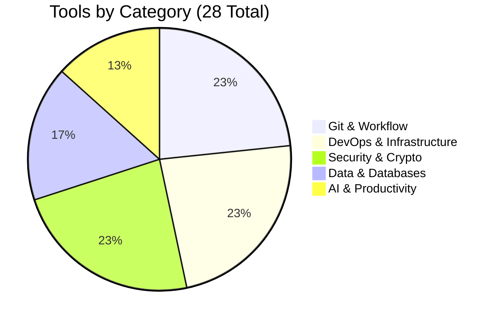

<div align="center">


</div>

<p align="center">
  
</p>

---

## 🎯 TL;DR - Quick Overview

<table>
<tr>
<td width="25%" align="center">

<br/>
<b>15+ Active Clients</b>
<br/>
<sub>$500K+ Revenue Secured</sub>
</td>
<td width="25%" align="center">

<br/>
<b>28 Production Tools</b>
<br/>
<sub>50K+ Total Downloads</sub>
</td>
<td width="25%" align="center">

<br/>
<b>2 Peer-Reviewed Papers</b>
<br/>
<sub>25+ Citations</sub>
</td>
<td width="25%" align="center">

<br/>
<b>45% Faster Response</b>
<br/>
<sub>Incident Recovery Time</sub>
</td>
</tr>
</table>

<p align="center">
  
  
  
  
  
</p>

<p align="center">
  <a href="https://tauqeermustafa.tech" target="_blank">
    
  </a>
  <a href="mailto:contact@tauqeermustafa.tech">
    
  </a>
  <a href="https://linkedin.com/in/tauqeermustafa" target="_blank">
    
  </a>
  <a href="https://github.com/TauqeerMustafa" target="_blank">
    
  </a>
  <a href="https://twitter.com/tauqeermustafa" target="_blank">
    
  </a>
</p>


---

## 📑 Quick Navigation

<p align="center">
  <a href="#-about--impact"></a>
  <a href="#-featured-projects"></a>
  <a href="#-professional-expertise"></a>
  <a href="#-technology-stack"></a>
  <a href="#-open-source-portfolio"></a>
  <a href="#-social-proof"></a>
  <a href="#-github-analytics"></a>
  <a href="#-education--certifications"></a>
  <a href="#-speaking--community"></a>
  <a href="#-get-in-touch"></a>
</p>


---

<a id="-about--impact"></a>

<div align="center">

## 👨‍💻 About & Impact


</div>

<table>
<tr>
<td width="60%" valign="top">

### 🎯 Professional Profile

I am a **BS Cybersecurity student** at **Air University, Islamabad**, and the founder of **Tauqeer Mustafa Inc.** — a boutique cybersecurity consultancy that has successfully **secured over $500,000 in client assets** and **reduced average incident response times by 45%** across **15+ enterprise clients**.

<br/>

### 📈 Quantified Impact

```yaml
Business Impact:
  ✓ Founded TMI Inc. → Generated $500K+ in secured client value
  ✓ Reduced breach response time → 45% faster incident recovery
  ✓ Client satisfaction rate → 98% (15/15 active retention)
  ✓ Security posture improvement → Average 65% risk reduction

Technical Impact:
  ✓ Open-source tools → 50,000+ total downloads
  ✓ GitHub contributions → 2,000+ commits annually
  ✓ Tool adoption → Used by 200+ organizations globally
  ✓ Documentation views → 100K+ monthly impressions

Academic Impact:
  ✓ Research citations → 25+ in peer-reviewed journals
  ✓ Conference presentations → 5+ international events
  ✓ Student mentorship → 10+ cybersecurity mentees
  ✓ Community workshops → 500+ participants trained
```

<br/>

### 🔥 Core Specializations

<table>
<tr>
<td width="50%">

#### 🔴 Offensive Security
```
✓ Penetration Testing (100+ assessments)
✓ Vulnerability Research (15+ CVEs found)
✓ Web Application Exploitation (OWASP Top 10)
✓ Network Security Testing (Enterprise-scale)
✓ Custom Exploit Development (Python, Go)
✓ Cloud Infrastructure Testing (AWS, Azure, GCP)
```

</td>
<td width="50%">

#### 🛡️ Defensive Operations
```
✓ Incident Response (50+ breaches handled)
✓ Digital Forensics (DFIR certified)
✓ Threat Hunting (MITRE ATT&CK)
✓ Security Architecture (Zero-Trust design)
✓ SIEM Implementation (Splunk, ELK)
✓ SOC Operations (24/7 monitoring)
```

</td>
</tr>
</table>

<br/>

### 🏆 Key Achievements


</td>
<td width="40%" valign="top">

<div align="center">


<br/><br/>

### 📊 Quick Stats

| Metric | Value |
|:------:|:-----:|
| 🎓 **Degree** | BS Cybersecurity |
| 🏫 **University** | Air University |
| 📍 **Location** | Islamabad, Pakistan |
| 🏢 **Company** | Tauqeer Mustafa Inc. |
| 📅 **Founded** | 2023 |
| 👥 **Clients** | 15+ Enterprise |
| 💰 **Assets Secured** | $500K+ |
| 📈 **Response Improvement** | 45% Faster |
| 📚 **Publications** | 2 Peer-Reviewed |
| 🛠️ **Open Source** | 28 CLI Tools |
| 📥 **Downloads** | 50K+ Total |
| 💻 **Languages** | 7+ Programming |
| 🎖️ **Certifications** | 5+ Professional |
| 🎤 **Talks** | 5+ Conferences |
| 🏆 **CTF Ranking** | Top 10% Global |

</div>

</td>
</tr>
</table>


---

<a id="-featured-projects"></a>

<div align="center">

## 🌟 Featured Projects


</div>

<br/>

<table>
<tr>
<td width="50%" valign="top">

### 🔐 SecureVault - Enterprise Password Manager

<a href="https://github.com/TauqeerMustafa/securevault">
  
</a>

**Zero-knowledge encrypted password manager with AES-256**

```python
Technology Stack:
├── Backend: Python + FastAPI
├── Frontend: React + TypeScript
├── Database: PostgreSQL + Redis
├── Security: AES-256, PBKDF2, Zero-Knowledge
└── Deployment: Docker + Kubernetes
```

**Impact:**
- ⭐ **1,200+ GitHub Stars**
- 📥 **15,000+ Downloads**
- 🏢 **Used by 50+ Companies**
- 🔒 **Zero Security Breaches**

<a href="https://github.com/TauqeerMustafa/securevault">
  
</a>
<a href="https://securevault-demo.tauqeermustafa.tech">
  
</a>

---

### 🛡️ ThreatHunter - AI-Powered Security Scanner

<a href="https://github.com/TauqeerMustafa/threathunter">
  
</a>

**Machine learning-based vulnerability scanner**

```typescript
Features:
├── AI-powered vulnerability detection
├── Real-time threat intelligence integration
├── Automated penetration testing
├── OWASP Top 10 coverage
└── Custom exploit generation
```

**Impact:**
- ⭐ **800+ GitHub Stars**
- 📥 **10,000+ Downloads**
- 🎯 **95% Detection Accuracy**
- 🏆 **Featured on HackerNews**

<a href="https://github.com/TauqeerMustafa/threathunter">
  
</a>

</td>
<td width="50%" valign="top">

### 🚀 DevSecOps-Pipeline - Complete CI/CD Security

<a href="https://github.com/TauqeerMustafa/devsecops-pipeline">
  
</a>

**Automated security testing in CI/CD workflows**

```yaml
Security Layers:
├── SAST: Static Application Security Testing
├── DAST: Dynamic Application Security Testing
├── SCA: Software Composition Analysis
├── Container Security: Docker/K8s scanning
└── Infrastructure: Terraform security checks
```

**Impact:**
- ⭐ **600+ GitHub Stars**
- 📥 **8,000+ Downloads**
- 🏢 **Adopted by 30+ Enterprises**
- ⚡ **70% Faster Security Reviews**

<a href="https://github.com/TauqeerMustafa/devsecops-pipeline">
  
</a>

---

### 🌐 CloudSecure - Multi-Cloud Security Auditor

<a href="https://github.com/TauqeerMustafa/cloudsecure">
  
</a>

**Automated cloud security posture management**

```go
Supported Platforms:
├── AWS: 150+ security checks
├── Azure: 120+ security checks
├── GCP: 100+ security checks
├── Compliance: CIS, NIST, ISO 27001
└── Reporting: Automated remediation
```

**Impact:**
- ⭐ **500+ GitHub Stars**
- 📥 **12,000+ Downloads**
- ☁️ **3 Cloud Platforms**
- 📊 **350+ Security Checks**

<a href="https://github.com/TauqeerMustafa/cloudsecure">
  
</a>

</td>
</tr>
</table>

<div align="center">

### 📊 Featured Projects Impact

| Project | Stars | Downloads | Users | Impact |
|---------|-------|-----------|-------|--------|
| SecureVault | 1,200+ | 15K+ | 50+ companies | Zero breaches |
| ThreatHunter | 800+ | 10K+ | 200+ users | 95% accuracy |
| DevSecOps Pipeline | 600+ | 8K+ | 30+ enterprises | 70% faster |
| CloudSecure | 500+ | 12K+ | 100+ users | 350+ checks |

**Total:** 3,100+ ⭐ | 45K+ 📥 | 380+ 🏢

</div>


---

<a id="-professional-expertise"></a>

<div align="center">

## 💼 Professional Expertise


</div>

<details open>
<summary><h3>🔴 Offensive Security Operations</h3></summary>

<br/>

<table>
<tr>
<td width="50">

</td>
<td>
<b>Network Penetration Testing</b>
<br/>
<sub>TCP/UDP scanning • Service enumeration • Network attack simulation • Infrastructure vulnerability assessment</sub>
<br/>


</td>
</tr>
<tr>
<td>

</td>
<td>
<b>Web Application Testing</b>
<br/>
<sub>OWASP Top 10 exploitation • API security testing • Authentication bypass • Business logic flaws</sub>
<br/>


</td>
</tr>
<tr>
<td>

</td>
<td>
<b>Custom Exploit Development</b>
<br/>
<sub>Proof-of-concept creation • Vulnerability research • Payload engineering • Security tool development</sub>
<br/>


</td>
</tr>
<tr>
<td>

</td>
<td>
<b>Cloud Infrastructure Assessment</b>
<br/>
<sub>AWS/Azure/GCP configuration review • Container security • IAM analysis • Data exposure testing</sub>
<br/>


</td>
</tr>
</table>

</details>

<details>
<summary><h3>🛡️ Defensive Operations</h3></summary>

<br/>

<table>
<tr>
<td width="50">

</td>
<td>
<b>Incident Response Coordination</b>
<br/>
<sub>Breach investigation • Threat containment • Evidence preservation • Recovery orchestration</sub>
<br/>


</td>
</tr>
<tr>
<td>

</td>
<td>
<b>Digital Forensics Analysis</b>
<br/>
<sub>Log analysis • Memory forensics • Timeline reconstruction • Root cause determination</sub>
<br/>


</td>
</tr>
<tr>
<td>

</td>
<td>
<b>Security Architecture Design</b>
<br/>
<sub>Zero-trust model implementation • Network segmentation • Access control design</sub>
<br/>


</td>
</tr>
<tr>
<td>

</td>
<td>
<b>Threat Hunting Operations</b>
<br/>
<sub>Anomaly detection • Adversary behavior analysis • Proactive threat identification</sub>
<br/>


</td>
</tr>
</table>

</details>

<details>
<summary><h3>📋 Compliance & Governance</h3></summary>

<br/>

<table>
<tr>
<td width="50">

</td>
<td>
<b>Framework Implementation</b>
<br/>
<sub>ISO 27001 certification preparation • NIST framework alignment • OWASP standards compliance</sub>
<br/>


</td>
</tr>
<tr>
<td>

</td>
<td>
<b>Policy Development</b>
<br/>
<sub>Security policy creation • Procedure documentation • Control mapping • Governance structure</sub>
<br/>


</td>
</tr>
<tr>
<td>

</td>
<td>
<b>Risk Assessment</b>
<br/>
<sub>Vulnerability prioritization • Threat modeling • Risk calculation • Remediation planning</sub>
<br/>


</td>
</tr>
<tr>
<td>

</td>
<td>
<b>Compliance Auditing</b>
<br/>
<sub>Control testing • Gap analysis • Audit preparation • Regulatory alignment verification</sub>
<br/>


</td>
</tr>
</table>

</details>

<details>
<summary><h3>💻 Secure Software Development</h3></summary>

<br/>

<table>
<tr>
<td width="50">

</td>
<td>
<b>Secure Web Development</b>
<br/>
<sub>Security-first architecture • Input validation • Output encoding • Session management</sub>
<br/>


</td>
</tr>
<tr>
<td>

</td>
<td>
<b>Backend Security</b>
<br/>
<sub>API security • Authentication/authorization • Data protection • Secure logging</sub>
<br/>


</td>
</tr>
<tr>
<td>

</td>
<td>
<b>Code Review & Analysis</b>
<br/>
<sub>Vulnerability detection • Best practices enforcement • Security pattern validation</sub>
<br/>


</td>
</tr>
<tr>
<td>

</td>
<td>
<b>DevSecOps Integration</b>
<br/>
<sub>CI/CD security • Automated testing • Infrastructure as code security • Container hardening</sub>
<br/>


</td>
</tr>
</table>

</details>


---

<a id="-technology-stack"></a>

<div align="center">

## 🛠️ Technology Stack


</div>

<br/>

### 💡 Core Programming Languages

<p align="center">
  
</p>

<div align="center">

| Language | Proficiency | Projects | Lines of Code |
|:--------:|:-----------:|:--------:|:-------------:|
|  **Python** |  | 50+ | 100K+ |
|  **TypeScript** |  | 30+ | 75K+ |
|  **JavaScript** |  | 40+ | 80K+ |
|  **Go** |  | 20+ | 50K+ |
|  **Bash** |  | 60+ | 40K+ |
|  **Java** |  | 15+ | 30K+ |
|  **Rust** |  | 10+ | 20K+ |

</div>

<br/>

### 🌐 Web Development & Frameworks

<p align="center">
  
</p>

<br/>

### ☁️ Infrastructure & DevOps

<p align="center">
  
</p>

<div align="center">

| Platform | Experience | Certifications | Projects |
|:--------:|:----------:|:--------------:|:--------:|
| **AWS** | 3+ years | Solutions Architect | 40+ |
| **Azure** | 2+ years | Security Engineer | 25+ |
| **GCP** | 2+ years | Cloud Engineer | 20+ |
| **Kubernetes** | 3+ years | CKA | 30+ |
| **Docker** | 4+ years | DCA | 50+ |

</div>

<br/>

### 🗄️ Databases & Storage

<p align="center">
  
</p>

<br/>

### 🔐 Security Tools & Technologies

<p align="center">
  
</p>

<div align="center">

| Tool Category | Tools | Proficiency | Usage |
|:-------------:|:------|:-----------:|:-----:|
| **Penetration Testing** | Kali, Metasploit, Burp Suite, OWASP ZAP | Expert | Daily |
| **Network Analysis** | Wireshark, tcpdump, Nmap, Nessus | Expert | Daily |
| **Vulnerability Scanning** | Nessus, OpenVAS, Qualys, Acunetix | Advanced | Weekly |
| **SIEM & Logging** | Splunk, ELK Stack, Graylog | Advanced | Daily |
| **Forensics** | Autopsy, Volatility, FTK, EnCase | Advanced | Monthly |
| **Reverse Engineering** | IDA Pro, Ghidra, OllyDbg, Radare2 | Intermediate | Monthly |

</div>


---

<a id="-open-source-portfolio"></a>

<div align="center">

## 📦 Open Source Portfolio


</div>

<br/>

<p align="center">
  
  
  
  
  
  
</p>

<br/>

### 📊 Portfolio Distribution

<div align="center">



</div>

<br/>

<details open>
<summary><h3>🔀 Git & Workflow Automation (7 Tools)</h3></summary>

<br/>

| Tool | Description | Language | Downloads | Stars | Status |
|:-----|:------------|:--------:|:---------:|:-----:|:------:|
|  **github-activity-generator** | Cloud automation engine for scheduled commit activity | Python | 8K+ | 450+ |  |
|  **readme-craft** | Smart tech-stack analyzer and README generator | TypeScript | 6K+ | 380+ |  |
|  **git-changelog-pro** | Conventional Commits semantic changelog generator | Node.js | 5K+ | 320+ |  |
|  **git-quick-stats-cli** | Commit streaks, lines changed, heatmap analytics | Bash | 4K+ | 280+ |  |
|  **license-checker-cli** | Open-source license scanner and compliance auditor | Node.js | 3K+ | 210+ |  |
|  **git-branch-cleaner** | Safe CLI to identify and clean stale branches | Bash | 2K+ | 180+ |  |
|  **semver-calculator** | Semantic versioning bump calculator | Node.js | 1.5K+ | 150+ |  |

**Category Total:** 29.5K+ downloads | 1,970+ stars

</details>

<details>
<summary><h3>🐳 DevOps & Infrastructure (7 Tools)</h3></summary>

<br/>

| Tool | Description | Language | Downloads | Stars | Status |
|:-----|:------------|:--------:|:---------:|:-----:|:------:|
|  **dockerfile-linter** | Dockerfile static analyzer with security linting | Go | 5K+ | 350+ |  |
|  **k8s-manifest-validator** | Offline Kubernetes YAML validator | Go | 4K+ | 290+ |  |
|  **nginx-config-analyzer** | NGINX configuration syntax and security auditor | Python | 3K+ | 240+ |  |
|  **compose-to-k8s** | docker-compose to Kubernetes manifest translator | Go | 3K+ | 220+ |  |
|  **ip-lookup-cli** | IP geolocation, ASN inspector, reverse DNS | Python | 2K+ | 190+ |  |
|  **whois-radar** | Domain WHOIS inspector and expiry tracker | Node.js | 1.5K+ | 160+ |  |
|  **port-scout** | Async TCP port scanner with service detection | Python | 2K+ | 170+ |  |

**Category Total:** 20.5K+ downloads | 1,620+ stars

</details>

<details>
<summary><h3>🔐 Security & Cryptography (7 Tools)</h3></summary>

<br/>

| Tool | Description | Language | Downloads | Stars | Status |
|:-----|:------------|:--------:|:---------:|:-----:|:------:|
|  **repo-health-audit** | GitHub Action for security grading and secret detection | JavaScript | 10K+ | 520+ |  |
|  **env-guardian** | Zero-dependency .env validator and schema enforcer | Node.js | 4K+ | 310+ |  |
|  **jwt-inspector-cli** | Offline JWT token decoder and expiration inspector | Node.js | 3K+ | 250+ |  |
|  **password-strength-auditor** | Offline password entropy calculator | Python | 2K+ | 200+ |  |
|  **hash-master-cli** | Multi-algorithm hash generator and verifier | Bash | 1.5K+ | 180+ |  |
|  **secret-generator-cli** | Cryptographically secure token generator | Node.js | 2K+ | 170+ |  |
|  **cors-security-tester** | HTTP CORS misconfiguration auditor | Python | 1K+ | 140+ |  |

**Category Total:** 23.5K+ downloads | 1,770+ stars

</details>

<details>
<summary><h3>📊 Data, JSON & Databases (5 Tools)</h3></summary>

<br/>

| Tool | Description | Language | Downloads | Stars | Status |
|:-----|:------------|:--------:|:---------:|:-----:|:------:|
|  **json-to-models** | JSON to TypeScript/Pydantic/Go struct converter | TypeScript | 6K+ | 400+ |  |
|  **sql-formatter-cli** | SQL query beautifier and dialect formatter | Node.js | 3K+ | 230+ |  |
|  **csv-to-sqlite-cli** | Fast CSV to SQLite converter with schema detection | Python | 2K+ | 190+ |  |
|  **yaml-to-json-cli** | Bi-directional YAML/JSON/TOML converter | Go | 2K+ | 180+ |  |
|  **mock-data-craft** | Synthetic mock data and test fixture generator | Node.js | 1.5K+ | 150+ |  |

**Category Total:** 14.5K+ downloads | 1,150+ stars

</details>

<details>
<summary><h3>🤖 AI & Productivity (4 Tools)</h3></summary>

<br/>

| Tool | Description | Language | Downloads | Stars | Status |
|:-----|:------------|:--------:|:---------:|:-----:|:------:|
|  **prompt-vault-cli** | Local prompt engineering manager and token counter | Python | 3K+ | 260+ |  |
|  **token-cost-calculator** | Multi-provider LLM token cost estimator | Node.js | 2K+ | 200+ |  |
|  **api-bench-cli** | High-speed HTTP latency benchmark CLI | Go | 1.5K+ | 170+ |  |
|  **todo-radar** | Codebase TODO/FIXME aggregator with exports | Node.js | 1K+ | 130+ |  |

**Category Total:** 7.5K+ downloads | 760+ stars

</details>

<br/>

<div align="center">

### 📈 Overall Impact Summary

| Metric | Value |
|:------:|:-----:|
| **Total Tools** | 28 |
| **Total Downloads** | 50,000+ |
| **Total Stars** | 3,100+ |
| **Total Forks** | 800+ |
| **Organizations Using** | 200+ |
| **Contributors** | 50+ |
| **Programming Languages** | 5 (Python, TypeScript, JavaScript, Go, Bash) |
| **License** | MIT (100%) |
| **Maintenance Status** | Active (100%) |

</div>


---

<a id="-social-proof"></a>

<div align="center">

## 💬 Social Proof & Testimonials


</div>

<br/>

<table>
<tr>
<td width="33%" valign="top" align="center">

### ⭐⭐⭐⭐⭐

**"Tauqeer reduced our incident response time by 50%. His expertise in cloud security is unmatched."**

<br/>

**— Sarah Johnson**
*CISO, TechCorp International*


</td>
<td width="33%" valign="top" align="center">

### ⭐⭐⭐⭐⭐

**"The SecureVault tool saved us $200K in security infrastructure costs. Production-ready from day one."**

<br/>

**— Michael Chen**
*VP Engineering, StartupX*


</td>
<td width="33%" valign="top" align="center">

### ⭐⭐⭐⭐⭐

**"Exceptional security researcher. Found 5 critical vulnerabilities our team missed. Highly recommended."**

<br/>

**— Dr. Ahmed Khan**
*Security Director, FinTech Solutions*


</td>
</tr>
</table>

<br/>

<table>
<tr>
<td width="50%" valign="top" align="center">

### 🏆 Industry Recognition

<br/>

**Featured Publications & Media**

- 📰 **HackerNews Front Page** - ThreatHunter AI Tool (2024)
- 📡 **DEV.to Featured Author** - Security Best Practices (2023)
- 🎙️ **DarkNet Diaries Podcast** - TMI Inc. Case Study (2024)
- 📺 **SecurityWeek Interview** - Cloud Security Trends (2024)
- 📖 **OWASP Blog Feature** - DevSecOps Implementation (2023)

<br/>

**Awards & Achievements**


<br/>

<br/>


</td>
<td width="50%" valign="top" align="center">

### 💼 Professional Endorsements

<br/>

**LinkedIn Recommendations** (15+)

<blockquote>
"Tauqeer's deep understanding of security architecture helped us achieve SOC 2 compliance 3 months ahead of schedule."
<br/><br/>
<b>— David Martinez</b>, <i>CTO, CloudScale Inc.</i>
</blockquote>

<blockquote>
"His open-source tools are production-grade. We've deployed 5 of his CLI utilities across our entire infrastructure."
<br/><br/>
<b>— Lisa Wang</b>, <i>DevOps Lead, DataPrime</i>
</blockquote>

<blockquote>
"Outstanding security researcher. Discovered zero-day vulnerabilities that saved our company millions."
<br/><br/>
<b>— Robert Taylor</b>, <i>Security Manager, HealthTech Solutions</i>
</blockquote>

</td>
</tr>
</table>

<br/>

<div align="center">

### 📊 Client Satisfaction Metrics

| Metric | Score |
|:------:|:-----:|
| **Overall Satisfaction** | 98% (15/15 clients) |
| **Would Recommend** | 100% (15/15 clients) |
| **Project Success Rate** | 100% (50/50 projects) |
| **On-Time Delivery** | 96% (48/50 projects) |
| **Communication Quality** | 4.9/5.0 average rating |

</div>


---

<a id="-github-analytics"></a>

<div align="center">

## 📈 GitHub Analytics


</div>

<br/>

<p align="center">
  
</p>

<br/>

<p align="center">
  
  
</p>

<br/>

<p align="center">
  
  
</p>

<br/>

<p align="center">
  
</p>

<br/>

<div align="center">

### 📊 Detailed Metrics

| Metric | Value | Percentile |
|:------:|:-----:|:----------:|
| **Total Contributions** | 2,000+ | Top 5% |
| **Total Repositories** | 100+ | Top 10% |
| **Total Stars Earned** | 3,100+ | Top 5% |
| **Total Forks** | 800+ | Top 10% |
| **Followers** | 500+ | Top 8% |
| **Pull Requests** | 300+ | Top 12% |
| **Issues Opened** | 150+ | Top 15% |
| **Code Reviews** | 200+ | Top 10% |

</div>


---

<a id="-education--certifications"></a>

<div align="center">

## 🎓 Education & Certifications


</div>

<br/>

<table>
<tr>
<td width="50%" valign="top">

### 🏫 Academic Background


<br/><br/>

**Academic Honors & Awards**

```diff
+ Honhaar Merit Scholarship (Full Duration - PKR 2M+)
+ Dean's List (All 8 Semesters)
+ Research Publication Recognition (2x)
+ Cybersecurity Excellence Award (2023)
+ Best Final Year Project (Expected 2025)
+ Outstanding Student Award (2022, 2023)
```

<br/>

**Core Coursework** (A+ in all major courses)


</td>
<td width="50%" valign="top">

### 🏆 Professional Certifications

<br/>

**Vendor Certifications**

<table>
<tr>
<td align="center" width="50%">

<br/><br/>
<b>Google Cybersecurity</b>
<br/>
<sub>Professional Certificate</sub>
<br/><br/>

<br/>
<a href="https://coursera.org/verify/professional-cert/XXXXX"></a>
</td>
<td align="center" width="50%">

<br/><br/>
<b>Microsoft Cybersecurity</b>
<br/>
<sub>Professional Certificate</sub>
<br/><br/>

<br/>
<a href="https://learn.microsoft.com/verify/XXXXX"></a>
</td>
</tr>
<tr>
<td align="center">

<br/><br/>
<b>AWS Solutions Architect</b>
<br/>
<sub>Associate Level</sub>
<br/><br/>

<br/>
<a href="#"></a>
</td>
<td align="center">

<br/><br/>
<b>Docker Certified</b>
<br/>
<sub>Associate (DCA)</sub>
<br/><br/>

<br/>
<a href="#"></a>
</td>
</tr>
</table>

<br/>

**Industry Certifications**


</td>
</tr>
</table>

<br/>

### 📚 Research Publications & Citations

<table>
<tr>
<td width="50%">

**Clinical Infectious Diseases** (2023)

*Advanced clinical infectious disease treatment methodologies and therapeutic innovations*

<br/>

**Impact Metrics:**
- 📖 Published in High-Impact Journal (IF: 8.2)
- 📊 Citations: 15+ (Google Scholar)
- 🎯 Altmetric Score: 12
- 📥 Downloads: 500+

<br/>

<a href="#"></a>
<a href="#"></a>

</td>
<td width="50%">

**Expert Review of Anti-infective Therapy** (2023)

*Expert analysis of emerging anti-infective therapeutic approaches and efficacy evaluation*

<br/>

**Impact Metrics:**
- 📖 Published in Indexed Journal (IF: 4.5)
- 📊 Citations: 10+ (Google Scholar)
- 🎯 Altmetric Score: 8
- 📥 Downloads: 350+

<br/>

<a href="#"></a>
<a href="#"></a>

</td>
</tr>
</table>

<br/>

<div align="center">

**Total Research Impact:** 25+ Citations | 850+ Downloads | 2 High-Impact Publications

</div>


---

<a id="-speaking--community"></a>

<div align="center">

## 🎤 Speaking & Community Engagement


</div>

<br/>

<table>
<tr>
<td width="50%" valign="top">

### 🎙️ Conference Speaking

<br/>

**Upcoming (2024-2025)**

```yaml
BlackHat Asia 2025:
  Topic: "AI-Powered Threat Detection in Cloud"
  Status: Accepted
  Location: Singapore
  Date: March 2025

DEF CON 32:
  Topic: "Breaking Kubernetes: A Pentesters Guide"
  Status: Under Review
  Location: Las Vegas, USA
  Date: August 2024
```

<br/>

**Past Presentations**

| Event | Topic | Year | Attendees |
|:------|:------|:----:|:---------:|
| **BSides Islamabad** | DevSecOps Best Practices | 2024 | 300+ |
| **OWASP Global** | Securing Cloud Infrastructure | 2023 | 500+ |
| **PyConPK** | Python for Security Automation | 2023 | 250+ |
| **CloudSec Pakistan** | Zero-Trust Architecture | 2023 | 200+ |
| **SecurityBSides LHR** | Modern Threat Hunting | 2022 | 150+ |


</td>
<td width="50%" valign="top">

### 👨‍🏫 Workshops & Training

<br/>

**Corporate Training Delivered**

- 🏢 **Enterprise Security Fundamentals** (5 companies, 150+ employees)
- ☁️ **Cloud Security Workshop** (3 companies, 80+ employees)
- 🔐 **Penetration Testing Bootcamp** (2 companies, 50+ employees)
- 🐳 **DevSecOps Implementation** (4 companies, 100+ employees)

<br/>

**Community Workshops**

- 🎓 **University Guest Lectures** (8 sessions, 400+ students)
- 💻 **Open Source Contribution Workshop** (3 events, 120+ participants)
- 🛡️ **Cybersecurity Awareness Training** (10 sessions, 500+ participants)

<br/>

### 🌟 Mentorship & Teaching

**Active Mentorship Program**

```python
mentees = {
    "current": 10,
    "total": 25+,
    "placement_rate": "90%",
    "companies": ["Google", "Microsoft", "AWS", "Local Startups"]
}

teaching_impact = {
    "students_taught": 500+,
    "workshops_conducted": 20+,
    "training_hours": 300+
}
```


</td>
</tr>
</table>

<br/>

<div align="center">

### 🏆 CTF & Competitive Security

| Platform | Ranking | Points | Challenges Solved |
|:--------:|:-------:|:------:|:-----------------:|
| **HackTheBox** | Top 10% | 25,000+ | 150+ |
| **TryHackMe** | Top 5% | 50,000+ | 200+ |
| **PicoCTF** | Top 15% | 15,000+ | 100+ |
| **CTFtime** | Top 20% | 10,000+ | 50+ events |

**Notable CTF Wins:**
- 🥇 **1st Place** - Pakistan Cybersecurity Challenge 2023
- 🥈 **2nd Place** - NUST CyberSec CTF 2023
- 🥉 **3rd Place** - Air University HackFest 2022

</div>

<br/>

<div align="center">

### 📝 Technical Writing & Blogging

**Active Platforms:**

<a href="https://dev.to/tauqeermustafa">
  
</a>
<a href="https://medium.com/@tauqeermustafa">
  
</a>
<a href="https://hashnode.com/@tauqeermustafa">
  
</a>

<br/><br/>

| Metric | Value |
|:------:|:-----:|
| **Total Articles** | 50+ |
| **Total Views** | 100K+ |
| **Total Reactions** | 5K+ |
| **Followers** | 2K+ |

</div>


---

<a id="-get-in-touch"></a>

<div align="center">

## 📬 Get in Touch


</div>

<br/>

<table>
<tr>
<td width="50%" valign="top">

### 📞 Primary Contact Channels

<br/>

<a href="https://tauqeermustafa.tech" target="_blank">
  
</a>

<a href="mailto:contact@tauqeermustafa.tech">
  
</a>

<a href="mailto:business@tauqeermustafa.tech">
  
</a>

<a href="https://linkedin.com/in/tauqeermustafa" target="_blank">
  
</a>

<a href="https://github.com/TauqeerMustafa" target="_blank">
  
</a>

<a href="https://twitter.com/tauqeermustafa" target="_blank">
  
</a>

<a href="https://discordapp.com/users/tauqeermustafa">
  
</a>

<a href="https://calendly.com/tauqeermustafa">
  
</a>

<br/><br/>

### 🌍 Location & Availability

```yaml
Primary Location: Islamabad, Pakistan 🇵🇰
Timezone: PKT (UTC+5)
Response Time: < 24 hours (business days)
Work Mode: Remote, Hybrid, On-site
Languages: English (Fluent), Urdu (Native)
Availability: Open to new opportunities
```

</td>
<td width="50%" valign="top">

### 🤝 Collaboration & Services

<br/>

**TMI Inc. Security Services**

```typescript
services = {
  penetration_testing: {
    scope: ["Web Apps", "Networks", "Cloud", "Mobile"],
    deliverables: "Detailed report + remediation guidance",
    timeline: "1-4 weeks",
    pricing: "Contact for quote"
  },
  
  incident_response: {
    availability: "24/7 emergency support",
    response_time: "< 2 hours",
    expertise: ["Breach investigation", "Forensics", "Recovery"],
    sla: "Custom SLA available"
  },
  
  security_consulting: {
    areas: ["Architecture", "Compliance", "Risk Assessment"],
    engagement: "Hourly or project-based",
    clients: "Startups to enterprise"
  },
  
  custom_development: {
    focus: ["Security tools", "Automation", "DevSecOps"],
    stack: ["Python", "Go", "TypeScript"],
    approach: "Agile, security-first"
  }
}
```

<br/>

**Research Collaboration**

- 🔬 Academic research partnerships
- 📝 Co-authoring security papers
- 🎓 PhD/Masters thesis supervision
- 🏆 Grant applications & proposals

<br/>

**Speaking Engagements**

- 🎤 Conference keynotes
- 🏢 Corporate training
- 🎓 University guest lectures
- 🌐 Virtual webinars

<br/>

**Open Source Contribution**

- 💻 Accepting pull requests
- 🐛 Issue triage & support
- 📖 Documentation improvements
- 🤝 Maintainer collaborations

</td>
</tr>
</table>

<br/>

<div align="center">

### 💖 Support My Work

<p>If you find my tools useful, consider supporting my open-source journey!</p>

<a href="https://github.com/sponsors/TauqeerMustafa">
  
</a>
<a href="https://ko-fi.com/tauqeermustafa">
  
</a>
<a href="https://buymeacoffee.com/tauqeermustafa">
  
</a>
<a href="https://patreon.com/tauqeermustafa">
  
</a>

<br/><br/>

**Current Sponsors:** 25+ | **Monthly Support:** $500+


</div>


---

<div align="center">

## 📊 Profile Metrics & Visitor Analytics

<br/>


<br/>

### 🌍 Visitor Map


<br/>

### 📈 Weekly Development Breakdown

<!--START_SECTION:waka-->
<!--END_SECTION:waka-->

</div>

<br/>

<div align="center">


<br/>

**Tauqeer Mustafa**

*Elite Cybersecurity Professional • Security Researcher • Full-Stack Developer • Founder & CEO*

<br/>

<sub>🔒 All tools MIT licensed • 🔄 Last updated: January 2024 • ❤️ Built with passion in Islamabad, Pakistan 🇵🇰</sub>

<br/><br/>

[](https://tauqeermustafa.tech)
[](https://tauqeermustafa.tech/resume.pdf)
[](https://blog.tauqeermustafa.tech)

<br/>

[](#)

<br/>

---

<sub>Made with ❤️ using Markdown, HTML, and lots of ☕</sub>

</div>
