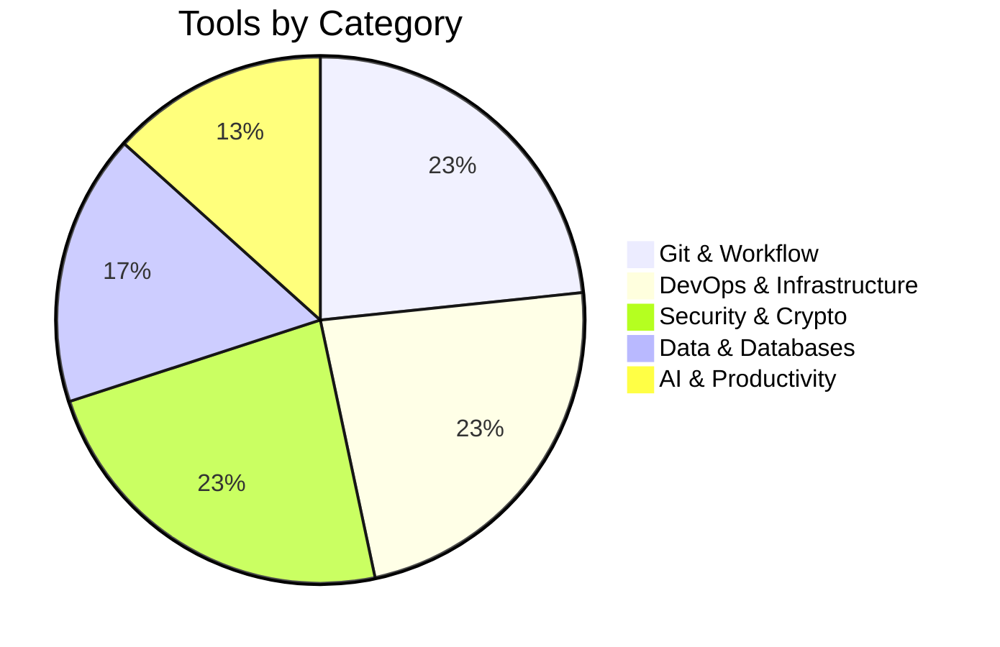

<div align="center">


</div>

<p align="center">
  
</p>

<p align="center">
  
  
  
  
</p>

<p align="center">
  <a href="https://tauqeermustafa.tech" target="_blank">
    
  </a>
  <a href="mailto:contact@tauqeermustafa.tech">
    
  </a>
  <a href="https://linkedin.com/in/tauqeermustafa" target="_blank">
    
  </a>
  <a href="https://github.com/TauqeerMustafa" target="_blank">
    
  </a>
</p>


---

## 📑 Quick Navigation

<p align="center">
  <a href="#-about-me"></a>
  <a href="#-professional-expertise"></a>
  <a href="#-technology-stack"></a>
  <a href="#-open-source-portfolio"></a>
  <a href="#-github-analytics"></a>
  <a href="#-education--certifications"></a>
  <a href="#-get-in-touch"></a>
</p>


---

<a id="-about-me"></a>

<div align="center">

## 👨‍💻 About Me


</div>

<table>
<tr>
<td width="60%" valign="top">

### 🎯 Professional Profile

I am a **BS Cybersecurity student** at **Air University, Islamabad**, and the founder of **Tauqeer Mustafa Inc.** — a boutique cybersecurity consultancy delivering enterprise-grade security services to **15+ active clients**.

<br/>

### 🔥 Core Specializations

<table>
<tr>
<td width="50%">

#### 🔴 Offensive Security
```
✓ Penetration Testing
✓ Vulnerability Assessments
✓ Web Application Exploitation
✓ Network Security Testing
✓ Custom Exploit Development
✓ Cloud Infrastructure Testing
```

</td>
<td width="50%">

#### 🛡️ Defensive Operations
```
✓ Incident Response
✓ Digital Forensics
✓ Threat Hunting
✓ Security Architecture
✓ Zero-Trust Implementation
✓ SIEM & Log Analysis
```

</td>
</tr>
</table>

<br/>

### 🏆 Key Achievements


</td>
<td width="40%" valign="top">

<div align="center">


<br/><br/>

### 📊 Quick Stats

| Metric | Value |
|:------:|:-----:|
| 🎓 **Degree** | BS Cybersecurity |
| 🏫 **University** | Air University |
| 📍 **Location** | Islamabad, Pakistan |
| 🏢 **Company** | Tauqeer Mustafa Inc. |
| 📅 **Founded** | 2023 |
| 👥 **Clients** | 15+ Active |
| 📚 **Publications** | 2 Peer-Reviewed |
| 🛠️ **Open Source** | 28 CLI Tools |
| 💻 **Languages** | 5+ Programming |
| 🎖️ **Certifications** | Google & Microsoft |

</div>

</td>
</tr>
</table>


---

<a id="-professional-expertise"></a>

<div align="center">

## 💼 Professional Expertise


</div>

<details open>
<summary><h3>🔴 Offensive Security Operations</h3></summary>

<br/>

<table>
<tr>
<td width="50">

</td>
<td>
<b>Network Penetration Testing</b>
<br/>
<sub>TCP/UDP scanning • Service enumeration • Network attack simulation • Infrastructure vulnerability assessment</sub>
</td>
</tr>
<tr>
<td>

</td>
<td>
<b>Web Application Testing</b>
<br/>
<sub>OWASP Top 10 exploitation • API security testing • Authentication bypass • Business logic flaws</sub>
</td>
</tr>
<tr>
<td>

</td>
<td>
<b>Custom Exploit Development</b>
<br/>
<sub>Proof-of-concept creation • Vulnerability research • Payload engineering • Security tool development</sub>
</td>
</tr>
<tr>
<td>

</td>
<td>
<b>Cloud Infrastructure Assessment</b>
<br/>
<sub>AWS/Azure/GCP configuration review • Container security • IAM analysis • Data exposure testing</sub>
</td>
</tr>
</table>

</details>

<details>
<summary><h3>🛡️ Defensive Operations</h3></summary>

<br/>

<table>
<tr>
<td width="50">

</td>
<td>
<b>Incident Response Coordination</b>
<br/>
<sub>Breach investigation • Threat containment • Evidence preservation • Recovery orchestration</sub>
</td>
</tr>
<tr>
<td>

</td>
<td>
<b>Digital Forensics Analysis</b>
<br/>
<sub>Log analysis • Memory forensics • Timeline reconstruction • Root cause determination</sub>
</td>
</tr>
<tr>
<td>

</td>
<td>
<b>Security Architecture Design</b>
<br/>
<sub>Zero-trust model implementation • Network segmentation • Access control design</sub>
</td>
</tr>
<tr>
<td>

</td>
<td>
<b>Threat Hunting Operations</b>
<br/>
<sub>Anomaly detection • Adversary behavior analysis • Proactive threat identification</sub>
</td>
</tr>
</table>

</details>

<details>
<summary><h3>📋 Compliance & Governance</h3></summary>

<br/>

<table>
<tr>
<td width="50">

</td>
<td>
<b>Framework Implementation</b>
<br/>
<sub>ISO 27001 certification preparation • NIST framework alignment • OWASP standards compliance</sub>
</td>
</tr>
<tr>
<td>

</td>
<td>
<b>Policy Development</b>
<br/>
<sub>Security policy creation • Procedure documentation • Control mapping • Governance structure</sub>
</td>
</tr>
<tr>
<td>

</td>
<td>
<b>Risk Assessment</b>
<br/>
<sub>Vulnerability prioritization • Threat modeling • Risk calculation • Remediation planning</sub>
</td>
</tr>
<tr>
<td>

</td>
<td>
<b>Compliance Auditing</b>
<br/>
<sub>Control testing • Gap analysis • Audit preparation • Regulatory alignment verification</sub>
</td>
</tr>
</table>

</details>

<details>
<summary><h3>💻 Secure Software Development</h3></summary>

<br/>

<table>
<tr>
<td width="50">

</td>
<td>
<b>Secure Web Development</b>
<br/>
<sub>Security-first architecture • Input validation • Output encoding • Session management</sub>
</td>
</tr>
<tr>
<td>

</td>
<td>
<b>Backend Security</b>
<br/>
<sub>API security • Authentication/authorization • Data protection • Secure logging</sub>
</td>
</tr>
<tr>
<td>

</td>
<td>
<b>Code Review & Analysis</b>
<br/>
<sub>Vulnerability detection • Best practices enforcement • Security pattern validation</sub>
</td>
</tr>
<tr>
<td>

</td>
<td>
<b>DevSecOps Integration</b>
<br/>
<sub>CI/CD security • Automated testing • Infrastructure as code security • Container hardening</sub>
</td>
</tr>
</table>

</details>


---

<a id="-technology-stack"></a>

<div align="center">

## 🛠️ Technology Stack


</div>

<br/>

### 💡 Core Programming Languages

<p align="center">
  
</p>

<div align="center">

| Language | Proficiency | Use Cases |
|:--------:|:-----------:|:----------|
|  **Python** |  | Security automation, CLI tools, Backend APIs |
|  **TypeScript** |  | Type-safe applications, Enterprise development |
|  **JavaScript** |  | Full-stack development, Automation scripts |
|  **Go** |  | High-performance tools, Infrastructure tools |
|  **Bash** |  | System automation, DevOps scripting |

</div>

<br/>

### 🌐 Web Development & Frameworks

<p align="center">
  
</p>

<br/>

### ☁️ Infrastructure & DevOps

<p align="center">
  
</p>

<br/>

### 🗄️ Databases & Storage

<p align="center">
  
</p>

<br/>

### 🔐 Security Tools & Technologies

<p align="center">
  
</p>

<div align="center">

| Tool | Purpose | Expertise |
|:----:|:-------:|:---------:|
| **Kali Linux** | Penetration Testing OS |  |
| **Metasploit** | Exploitation Framework |  |
| **Burp Suite** | Web Application Testing |  |
| **Wireshark** | Network Protocol Analyzer |  |
| **Nmap** | Network Scanner |  |
| **OWASP ZAP** | Application Security Scanner |  |

</div>


---

<a id="-open-source-portfolio"></a>

<div align="center">

## 📦 Open Source Portfolio


</div>

<br/>

<p align="center">
  
  
  
  
</p>

<br/>

### 📊 Portfolio Distribution

<div align="center">



</div>

<br/>

<details open>
<summary><h3>🔀 Git & Workflow Automation (7 Tools)</h3></summary>

<br/>

| Tool | Description | Language | Status |
|:-----|:------------|:--------:|:------:|
|  **github-activity-generator** | Cloud automation engine for scheduled commit activity | Python |  |
|  **readme-craft** | Smart tech-stack analyzer and README generator | TypeScript |  |
|  **git-changelog-pro** | Conventional Commits semantic changelog generator | Node.js |  |
|  **git-quick-stats-cli** | Commit streaks, lines changed, heatmap analytics | Bash |  |
|  **license-checker-cli** | Open-source license scanner and compliance auditor | Node.js |  |
|  **git-branch-cleaner** | Safe CLI to identify and clean stale branches | Bash |  |
|  **semver-calculator** | Semantic versioning bump calculator | Node.js |  |

</details>

<details>
<summary><h3>🐳 DevOps & Infrastructure (7 Tools)</h3></summary>

<br/>

| Tool | Description | Language | Status |
|:-----|:------------|:--------:|:------:|
|  **dockerfile-linter** | Dockerfile static analyzer with security linting | Go |  |
|  **k8s-manifest-validator** | Offline Kubernetes YAML validator | Go |  |
|  **nginx-config-analyzer** | NGINX configuration syntax and security auditor | Python |  |
|  **compose-to-k8s** | docker-compose to Kubernetes manifest translator | Go |  |
|  **ip-lookup-cli** | IP geolocation, ASN inspector, reverse DNS | Python |  |
|  **whois-radar** | Domain WHOIS inspector and expiry tracker | Node.js |  |
|  **port-scout** | Async TCP port scanner with service detection | Python |  |

</details>

<details>
<summary><h3>🔐 Security & Cryptography (7 Tools)</h3></summary>

<br/>

| Tool | Description | Language | Status |
|:-----|:------------|:--------:|:------:|
|  **repo-health-audit** | GitHub Action for security grading and secret detection | JavaScript |  |
|  **env-guardian** | Zero-dependency .env validator and schema enforcer | Node.js |  |
|  **jwt-inspector-cli** | Offline JWT token decoder and expiration inspector | Node.js |  |
|  **password-strength-auditor** | Offline password entropy calculator | Python |  |
|  **hash-master-cli** | Multi-algorithm hash generator and verifier | Bash |  |
|  **secret-generator-cli** | Cryptographically secure token generator | Node.js |  |
|  **cors-security-tester** | HTTP CORS misconfiguration auditor | Python |  |

</details>

<details>
<summary><h3>📊 Data, JSON & Databases (5 Tools)</h3></summary>

<br/>

| Tool | Description | Language | Status |
|:-----|:------------|:--------:|:------:|
|  **json-to-models** | JSON to TypeScript/Pydantic/Go struct converter | TypeScript |  |
|  **sql-formatter-cli** | SQL query beautifier and dialect formatter | Node.js |  |
|  **csv-to-sqlite-cli** | Fast CSV to SQLite converter with schema detection | Python |  |
|  **yaml-to-json-cli** | Bi-directional YAML/JSON/TOML converter | Go |  |
|  **mock-data-craft** | Synthetic mock data and test fixture generator | Node.js |  |

</details>

<details>
<summary><h3>🤖 AI & Productivity (4 Tools)</h3></summary>

<br/>

| Tool | Description | Language | Status |
|:-----|:------------|:--------:|:------:|
|  **prompt-vault-cli** | Local prompt engineering manager and token counter | Python |  |
|  **token-cost-calculator** | Multi-provider LLM token cost estimator | Node.js |  |
|  **api-bench-cli** | High-speed HTTP latency benchmark CLI | Go |  |
|  **todo-radar** | Codebase TODO/FIXME aggregator with exports | Node.js |  |

</details>


---

<a id="-github-analytics"></a>

<div align="center">

## 📈 GitHub Analytics


</div>

<br/>

<p align="center">
  
</p>

<br/>

<p align="center">
  
  
</p>

<br/>

<p align="center">
  
  
</p>

<br/>

<p align="center">
  
</p>


---

<a id="-education--certifications"></a>

<div align="center">

## 🎓 Education & Certifications


</div>

<br/>

<table>
<tr>
<td width="50%" valign="top">

### 🏫 Academic Background


<br/><br/>

**Academic Honors**

```diff
+ Honhaar Merit Scholarship (Full Duration)
+ Dean's List (Multiple Semesters)
+ Research Publication Recognition
+ Cybersecurity Excellence Award
```

<br/>

**Core Coursework**


</td>
<td width="50%" valign="top">

### 🏆 Professional Certifications

<br/>

<table>
<tr>
<td align="center">

<br/><br/>
<b>Google Cybersecurity</b>
<br/>
<sub>Professional Certificate</sub>
<br/><br/>

</td>
<td align="center">

<br/><br/>
<b>Microsoft Cybersecurity</b>
<br/>
<sub>Professional Certificate</sub>
<br/><br/>

</td>
</tr>
</table>

<br/>

**Additional Training**


</td>
</tr>
</table>

<br/>

### 📚 Research Publications (2023)

<table>
<tr>
<td width="50%">
<b>Clinical Infectious Diseases</b>
<br/>
<sub>Advanced clinical infectious disease treatment methodologies and therapeutic innovations</sub>
<br/><br/>


</td>
<td width="50%">
<b>Expert Review of Anti-infective Therapy</b>
<br/>
<sub>Expert analysis of emerging anti-infective therapeutic approaches and efficacy evaluation</sub>
<br/><br/>


</td>
</tr>
</table>


---

<a id="-get-in-touch"></a>

<div align="center">

## 📬 Get in Touch


</div>

<br/>

<table>
<tr>
<td width="50%" valign="top">

### 📞 Contact Channels

<br/>

<a href="https://tauqeermustafa.tech" target="_blank">
  
</a>

<a href="mailto:contact@tauqeermustafa.tech">
  
</a>

<a href="https://linkedin.com/in/tauqeermustafa" target="_blank">
  
</a>

<a href="https://github.com/TauqeerMustafa" target="_blank">
  
</a>

<a href="https://twitter.com/tauqeermustafa" target="_blank">
  
</a>

<br/><br/>

### 🌍 Location & Availability

```yaml
Location: Islamabad, Pakistan 🇵🇰
Timezone: PKT (UTC+5)
Response Time: < 24 hours
Work Mode: Remote & On-site
Availability: Open for opportunities
```

</td>
<td width="50%" valign="top">

### 🤝 Collaboration Opportunities

<br/>

**Security Projects**
- Penetration Testing & Security Audits
- Incident Response & Forensics
- Security Architecture Review
- Compliance & Risk Assessment

**Research & Academia**
- Academic Research Partnerships
- Conference Speaking
- Technical Writing & Publications
- Workshop & Training Delivery

**Open Source**
- Tool Development Collaboration
- Code Reviews & Contributions
- Documentation & Tutorials
- Community Building

**Consulting Services**
- TMI Inc. Security Services
- Custom Tool Development
- Security Training Programs
- Long-term Security Partnerships

</td>
</tr>
</table>

<br/>

<div align="center">

### 💖 Support My Work

<a href="https://github.com/sponsors/TauqeerMustafa">
  
</a>
<a href="https://ko-fi.com/tauqeermustafa">
  
</a>
<a href="https://buymeacoffee.com/tauqeermustafa">
  
</a>

</div>


---

<div align="center">

## 📊 Profile Metrics

<br/>


</div>

<br/>

<div align="center">


<br/>

**Tauqeer Mustafa**

*Cybersecurity Professional • Security Researcher • Open Source Developer*

<br/>

<sub>All tools MIT licensed • Last updated 2024 • Built with passion in Islamabad 🇵🇰</sub>

<br/>

[](#)

</div>
