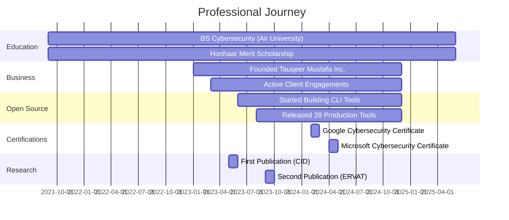

# Tauqeer Mustafa - Well-Organized Professional Profile

```markdown
<div align="center">


</div>

<br/>

<!-- Quick Navigation -->
<div align="center">

**📑 QUICK NAVIGATION**

[About](#-about-me) • [Skills](#-skills--expertise) • [Tools](#-open-source-portfolio) • [Stats](#-github-statistics) • [Education](#-education--credentials) • [Journey](#-professional-journey) • [Contact](#-lets-connect)

</div>

<br/>

<div align="center">

<!-- Social Badges -->
<a href="https://tauqeermustafa.tech">
  
</a>
<a href="mailto:contact@tauqeermustafa.tech">
  
</a>
<a href="https://linkedin.com/in/tauqeermustafa">
  
</a>
<a href="https://github.com/TauqeerMustafa">
  
</a>

</div>

<br/>

<!-- Metrics Row -->
<div align="center">

<table>
<tr>
<td align="center">

<br/><sub><b>Honhaar Program</b></sub>
</td>
<td align="center">

<br/><sub><b>Air University</b></sub>
</td>
<td align="center">

<br/><sub><b>Peer Reviewed</b></sub>
</td>
<td align="center">

<br/><sub><b>Open Source</b></sub>
</td>
<td align="center">

<br/><sub><b>Google · Microsoft</b></sub>
</td>
<td align="center">

<br/><sub><b>TMI Inc.</b></sub>
</td>
</tr>
</table>

</div>

<br/>


<br/>

## 👋 About Me


<div align="left">

### Hi there! I'm Tauqeer 👨‍💻

I'm a **BS Cybersecurity student** at Air University in Islamabad, Pakistan, and a **Honhaar Merit Scholar**. I founded **Tauqeer Mustafa Inc.** to bring enterprise-grade security services to small and mid-sized businesses.

<br/>

**🎯 What I Do:**
- 🔐 Security assessments and penetration testing
- 🚨 Incident response and digital forensics
- 📋 Compliance advisory (ISO 27001, NIST)
- 💻 Secure application development
- 🛠️ Open source security tools

<br/>

**🔬 Research Focus:**
- Offensive security techniques
- Applied AI in cybersecurity
- Automated vulnerability detection
- Machine learning for threat intelligence

<br/>

**📊 Quick Stats:**

<table>
<tr>
<td><b>📍 Location</b></td>
<td>Islamabad, Pakistan</td>
<td><b>🎓 Education</b></td>
<td>BS Cybersecurity (2021-2025)</td>
</tr>
<tr>
<td><b>💼 Company</b></td>
<td>Tauqeer Mustafa Inc.</td>
<td><b>🏅 Scholarship</b></td>
<td>Honhaar Merit Scholar</td>
</tr>
<tr>
<td><b>🔬 Research</b></td>
<td>2 Peer-Reviewed Papers</td>
<td><b>🛠️ Projects</b></td>
<td>28 Open Source Tools</td>
</tr>
<tr>
<td><b>📜 Certs</b></td>
<td>Google, Microsoft</td>
<td><b>🎯 Focus</b></td>
<td>Offensive Security · AI</td>
</tr>
</table>

</div>

<br clear="right"/>

<br/>


<br/>

## 🛡️ Skills & Expertise

<br/>

### 💻 Technical Stack

<div align="center">

#### Programming Languages


<br/>

| Language | Proficiency | Primary Use |
|----------|-------------|-------------|
| **Python** | ⭐⭐⭐⭐⭐ | Security automation, pentesting scripts, CLI tools |
| **TypeScript** | ⭐⭐⭐⭐ | Full-stack development, type-safe applications |
| **JavaScript** | ⭐⭐⭐⭐⭐ | Web development, Node.js backends, automation |
| **Go** | ⭐⭐⭐⭐ | Performance-critical tools, infrastructure utilities |
| **Bash** | ⭐⭐⭐⭐⭐ | System administration, DevOps automation |
| **SQL** | ⭐⭐⭐⭐ | Database design, queries, optimization |

<br/>

#### Frameworks & Libraries


<br/>

#### Infrastructure & DevOps


<br/>

#### Databases & Tools


</div>

<br/>

### 🎯 Core Competencies

<table width="100%">
<tr>
<td width="50%" valign="top">

#### 🔴 Offensive Security

```yaml
Penetration Testing:
  - Web Application Security
  - Network Penetration Testing
  - API Security Assessment
  - Mobile Application Testing

Vulnerability Research:
  - 0-day Discovery
  - Exploit Development
  - Security Tool Creation
  - CVE Documentation

Red Team Operations:
  - Social Engineering
  - Phishing Campaigns
  - Physical Security Testing
  - Advanced Persistent Threats
```

<br/>

#### 🟢 Application Security

```yaml
Secure Development:
  - OWASP Top 10 Mitigation
  - Secure Code Review
  - Threat Modeling
  - Security Architecture

DevSecOps:
  - CI/CD Security Integration
  - Container Security
  - Infrastructure as Code Security
  - Automated Security Testing
```

</td>
<td width="50%" valign="top">

#### 🔵 Defensive Security

```yaml
Incident Response:
  - Breach Investigation
  - Digital Forensics
  - Malware Analysis
  - Threat Containment

Security Operations:
  - SIEM Configuration
  - Log Analysis
  - Threat Hunting
  - Security Monitoring
```

<br/>

#### 🟡 Compliance & Governance

```yaml
Frameworks & Standards:
  - ISO 27001 Implementation
  - NIST Cybersecurity Framework
  - PCI DSS Compliance
  - GDPR Requirements

Risk Management:
  - Security Assessments
  - Risk Analysis
  - Policy Development
  - Audit Preparation
```

</td>
</tr>
</table>

<br/>

### 🔧 Security Toolset

<div align="center">

<table>
<tr>
<td align="center" width="14.28%">
<br/>
<sub><b>Kali Linux</b></sub>
</td>
<td align="center" width="14.28%">
<br/>
<sub><b>Metasploit</b></sub>
</td>
<td align="center" width="14.28%">
<br/>
<sub><b>Burp Suite</b></sub>
</td>
<td align="center" width="14.28%">
<br/>
<sub><b>Wireshark</b></sub>
</td>
<td align="center" width="14.28%">
<br/>
<sub><b>Nmap</b></sub>
</td>
<td align="center" width="14.28%">
<br/>
<sub><b>OWASP ZAP</b></sub>
</td>
<td align="center" width="14.28%">
<br/>
<sub><b>Ghidra</b></sub>
</td>
</tr>
<tr>
<td align="center">
<br/>
<sub><b>Hashcat</b></sub>
</td>
<td align="center">
<br/>
<sub><b>John</b></sub>
</td>
<td align="center">
<br/>
<sub><b>sqlmap</b></sub>
</td>
<td align="center">
<br/>
<sub><b>Nikto</b></sub>
</td>
<td align="center">
<br/>
<sub><b>Nessus</b></sub>
</td>
<td align="center">
<br/>
<sub><b>Aircrack</b></sub>
</td>
<td align="center">
<br/>
<sub><b>Hydra</b></sub>
</td>
</tr>
</table>

</div>

<br/>


<br/>

## 🛠️ Open Source Portfolio

<div align="center">


</div>

<br/>

### 📦 Portfolio Overview

<div align="center">

<table>
<tr>
<td align="center" width="20%">

<br/><br/>

<br/><sub>Automation & Version Control</sub>
</td>
<td align="center" width="20%">

<br/><br/>

<br/><sub>Infrastructure & Deployment</sub>
</td>
<td align="center" width="20%">

<br/><br/>

<br/><sub>Cryptography & Security</sub>
</td>
<td align="center" width="20%">

<br/><br/>

<br/><sub>Data Processing & Storage</sub>
</td>
<td align="center" width="20%">

<br/><br/>

<br/><sub>AI Tools & Utilities</sub>
</td>
</tr>
</table>

</div>

<br/>

### 🔧 Tools by Category

<details open>
<summary><h4>⚙️ Git & Workflow Automation (7 Tools)</h4></summary>

<br/>

<table>
<tr>
<th width="25%">Tool Name</th>
<th width="50%">Description</th>
<th width="15%">Language</th>
<th width="10%">Status</th>
</tr>
<tr>
<td><b>🚀 github-activity-generator</b></td>
<td>Cloud automation engine for scheduled commit activity with GitHub Actions integration and customizable patterns</td>
<td align="center"></td>
<td align="center"></td>
</tr>
<tr>
<td><b>📝 readme-craft</b></td>
<td>Smart tech-stack analyzer and CLI-powered README generator with automatic badge detection and template system</td>
<td align="center"></td>
<td align="center"></td>
</tr>
<tr>
<td><b>📋 git-changelog-pro</b></td>
<td>Conventional Commits semantic changelog generator with multi-format export and version bump suggestions</td>
<td align="center"></td>
<td align="center"></td>
</tr>
<tr>
<td><b>📈 git-quick-stats-cli</b></td>
<td>Comprehensive commit analytics including streaks, lines changed, contributor stats, and visual heatmaps</td>
<td align="center"></td>
<td align="center"></td>
</tr>
<tr>
<td><b>⚖️ license-checker-cli</b></td>
<td>Open-source license scanner with dependency analysis, compatibility checking, and compliance reporting</td>
<td align="center"></td>
<td align="center"></td>
</tr>
<tr>
<td><b>🧹 git-branch-cleaner</b></td>
<td>Safe CLI utility to identify and clean stale merged branches with dry-run mode and multi-repo support</td>
<td align="center"></td>
<td align="center"></td>
</tr>
<tr>
<td><b>🔢 semver-calculator</b></td>
<td>Semantic versioning calculator with bump predictions, range validation, and automated version suggestions</td>
<td align="center"></td>
<td align="center"></td>
</tr>
</table>

</details>

<details>
<summary><h4>🐳 DevOps & Infrastructure (7 Tools)</h4></summary>

<br/>

<table>
<tr>
<th width="25%">Tool Name</th>
<th width="50%">Description</th>
<th width="15%">Language</th>
<th width="10%">Status</th>
</tr>
<tr>
<td><b>🐋 dockerfile-linter</b></td>
<td>Fast Dockerfile static analyzer with security linting, best practice validation, and optimization recommendations</td>
<td align="center"></td>
<td align="center"></td>
</tr>
<tr>
<td><b>☸️ k8s-manifest-validator</b></td>
<td>Offline Kubernetes YAML manifest validator with schema checking, resource validation, and security auditing</td>
<td align="center"></td>
<td align="center"></td>
</tr>
<tr>
<td><b>⚙️ nginx-config-analyzer</b></td>
<td>NGINX configuration syntax auditor with security hardening suggestions and performance optimization tips</td>
<td align="center"></td>
<td align="center"></td>
</tr>
<tr>
<td><b>🔄 compose-to-k8s</b></td>
<td>Automatic docker-compose to Kubernetes manifest translator with ConfigMap and Service generation</td>
<td align="center"></td>
<td align="center"></td>
</tr>
<tr>
<td><b>🌐 ip-lookup-cli</b></td>
<td>Fast IP geolocation tool with ASN inspection, reverse DNS lookup, and abuse contact detection</td>
<td align="center"></td>
<td align="center"></td>
</tr>
<tr>
<td><b>📡 whois-radar</b></td>
<td>Domain WHOIS inspector with registrar details, expiry tracking, bulk checking, and historical data</td>
<td align="center"></td>
<td align="center"></td>
</tr>
<tr>
<td><b>🔍 port-scout</b></td>
<td>High-performance asynchronous TCP port scanner with service detection, banner grabbing, and export options</td>
<td align="center"></td>
<td align="center"></td>
</tr>
</table>

</details>

<details>
<summary><h4>🔐 Security & Cryptography (7 Tools)</h4></summary>

<br/>

<table>
<tr>
<th width="25%">Tool Name</th>
<th width="50%">Description</th>
<th width="15%">Language</th>
<th width="10%">Status</th>
</tr>
<tr>
<td><b>🔒 repo-health-audit</b></td>
<td>GitHub Action for comprehensive security grading, secret detection, and repository health scoring</td>
<td align="center"></td>
<td align="center"></td>
</tr>
<tr>
<td><b>🛡️ env-guardian</b></td>
<td>Zero-dependency .env file validator with schema enforcement, type checking, and required field validation</td>
<td align="center"></td>
<td align="center"></td>
</tr>
<tr>
<td><b>🔑 jwt-inspector-cli</b></td>
<td>Safe offline JWT token decoder with expiration checking, claim validation, and algorithm analysis</td>
<td align="center"></td>
<td align="center"></td>
</tr>
<tr>
<td><b>🔐 password-strength-auditor</b></td>
<td>Comprehensive password entropy calculator with pattern detection, dictionary checking, and strength scoring</td>
<td align="center"></td>
<td align="center"></td>
</tr>
<tr>
<td><b>#️⃣ hash-master-cli</b></td>
<td>Multi-algorithm hash generator supporting MD5, SHA-1/256/512 with checksum verification and batch processing</td>
<td align="center"></td>
<td align="center"></td>
</tr>
<tr>
<td><b>🎲 secret-generator-cli</b></td>
<td>Cryptographically secure random token, API key, and UUID generator with custom length and format options</td>
<td align="center"></td>
<td align="center"></td>
</tr>
<tr>
<td><b>🔗 cors-security-tester</b></td>
<td>HTTP CORS header misconfiguration auditor with security recommendations and bulk endpoint testing</td>
<td align="center"></td>
<td align="center"></td>
</tr>
</table>

</details>

<details>
<summary><h4>📊 Data, JSON & Databases (5 Tools)</h4></summary>

<br/>

<table>
<tr>
<th width="25%">Tool Name</th>
<th width="50%">Description</th>
<th width="15%">Language</th>
<th width="10%">Status</th>
</tr>
<tr>
<td><b>🔄 json-to-models</b></td>
<td>Intelligent JSON to TypeScript, Pydantic, and Go struct converter with nested structure support</td>
<td align="center"></td>
<td align="center"></td>
</tr>
<tr>
<td><b>✨ sql-formatter-cli</b></td>
<td>Offline SQL query beautifier, minifier, and multi-dialect formatter with syntax highlighting</td>
<td align="center"></td>
<td align="center"></td>
</tr>
<tr>
<td><b>📥 csv-to-sqlite-cli</b></td>
<td>High-performance CSV/TSV to SQLite converter with automatic schema detection and type inference</td>
<td align="center"></td>
<td align="center"></td>
</tr>
<tr>
<td><b>🔀 yaml-to-json-cli</b></td>
<td>Bi-directional converter for YAML, JSON, and TOML formats with validation and pretty printing</td>
<td align="center"></td>
<td align="center"></td>
</tr>
<tr>
<td><b>🎭 mock-data-craft</b></td>
<td>Realistic synthetic data generator for testing with custom schemas and multiple export formats</td>
<td align="center"></td>
<td align="center"></td>
</tr>
</table>

</details>

<details>
<summary><h4>🤖 AI & Productivity (4 Tools)</h4></summary>

<br/>

<table>
<tr>
<th width="25%">Tool Name</th>
<th width="50%">Description</th>
<th width="15%">Language</th>
<th width="10%">Status</th>
</tr>
<tr>
<td><b>💬 prompt-vault-cli</b></td>
<td>Local prompt engineering manager with version control, token counting, and template management system</td>
<td align="center"></td>
<td align="center"></td>
</tr>
<tr>
<td><b>💰 token-cost-calculator</b></td>
<td>Multi-provider LLM cost estimator for OpenAI, Anthropic, and Google with budget tracking</td>
<td align="center"></td>
<td align="center"></td>
</tr>
<tr>
<td><b>⚡ api-bench-cli</b></td>
<td>High-speed HTTP latency benchmark tool with concurrent request testing and detailed metrics export</td>
<td align="center"></td>
<td align="center"></td>
</tr>
<tr>
<td><b>📝 todo-radar</b></td>
<td>Codebase TODO/FIXME comment aggregator with priority sorting, Markdown export, and team reporting</td>
<td align="center"></td>
<td align="center"></td>
</tr>
</table>

</details>

<br/>

### 💡 Design Philosophy

<div align="center">

```yaml
principles:
  focus: "Single-purpose tools that do one job exceptionally well"
  dependencies: "Minimal external dependencies for maximum portability"
  documentation: "Clear, comprehensive docs with real-world examples"
  code_quality: "Simple, auditable code that developers can trust"
  licensing: "MIT licensed for maximum reusability"
  
approach:
  - Build for the problems I encounter in real security work
  - Prioritize developer experience and ease of use
  - Maintain production-ready quality standards
  - Listen to community feedback and iterate
```

</div>

<br/>

<div align="center">


</div>

<br/>


<br/>

## 📊 GitHub Statistics

<br/>

<div align="center">

### 📈 Contribution Activity


<br/><br/>

### 📊 Performance Metrics

<table>
<tr>
<td width="50%">


</td>
<td width="50%">


</td>
</tr>
</table>

<br/>

### 💻 Language Distribution


<br/><br/>

### 🏆 Achievement Showcase


<br/><br/>

### 🐍 Contribution Snake

<picture>
  <source media="(prefers-color-scheme: dark)" srcset="https://raw.githubusercontent.com/TauqeerMustafa/TauqeerMustafa/output/github-contribution-grid-snake-dark.svg">
  <source media="(prefers-color-scheme: light)" srcset="https://raw.githubusercontent.com/TauqeerMustafa/TauqeerMustafa/output/github-contribution-grid-snake.svg">
  
</picture>

</div>

<br/>


<br/>

## 🎓 Education & Credentials

<br/>

### 🏛️ Academic Background

<table>
<tr>
<td width="70%" valign="top">

#### BS Cybersecurity — Air University

**Islamabad, Pakistan** | *2021 — 2025 (Expected)*

<br/>

**🏆 Honors & Recognition:**
- Honhaar Merit Scholarship (Awarded for academic excellence)
- Dean's List (Multiple semesters)
- Research Publication Award (2023)

<br/>

**📚 Core Coursework:**
- Advanced Network Security & Cryptography
- Penetration Testing & Ethical Hacking
- Digital Forensics & Incident Response
- Secure Software Development
- Cloud & Infrastructure Security
- Machine Learning for Cybersecurity
- Risk Management & Compliance
- Malware Analysis & Reverse Engineering

<br/>

**🔬 Research Contributions:**
- 2 Peer-reviewed publications in high-impact journals
- Active participation in university security research lab
- Presented findings at institutional conferences
- Collaborated on interdisciplinary research projects

</td>
<td width="30%" valign="top" align="center">


<br/><br/>

**Quick Facts**

<br/>


</td>
</tr>
</table>

<br/>

### 🏅 Professional Certifications

<table>
<tr>
<td width="50%" align="center" valign="top">


<br/><br/>

**Google Cybersecurity**
<br/>
**Professional Certificate**

<br/>

*Issued: 2024*

<br/>


<br/><br/>

**Skills Covered:**
- Security Frameworks (NIST, OWASP)
- Network Security & Hardening
- Linux & SQL Fundamentals
- Incident Detection & Response
- Python for Security Automation
- Vulnerability Assessment
- Security Information & Event Management (SIEM)
- Threat Intelligence & Analysis

</td>
<td width="50%" align="center" valign="top">


<br/><br/>

**Microsoft Cybersecurity**
<br/>
**Professional Certificate**

<br/>

*Issued: 2024*

<br/>


<br/><br/>

**Skills Covered:**
- Azure Security & Compliance
- Cloud Security Architecture
- Identity & Access Management
- Security Operations Center (SOC)
- Threat Protection & Detection
- Zero Trust Security Model
- Data Protection & Governance
- Incident Response Planning

</td>
</tr>
</table>

<br/>

### 📚 Additional Training & Certifications

<div align="center">

<table>
<tr>
<td align="center" width="16.66%">
<br/>
<sub><b>Web Security</b></sub>
</td>
<td align="center" width="16.66%">
<br/>
<sub><b>Compliance</b></sub>
</td>
<td align="center" width="16.66%">
<br/>
<sub><b>Standards</b></sub>
</td>
<td align="center" width="16.66%">
<br/>
<sub><b>Ethical Hacking</b></sub>
</td>
<td align="center" width="16.66%">
<br/>
<sub><b>Cloud Security</b></sub>
</td>
<td align="center" width="16.66%">
<br/>
<sub><b>System Admin</b></sub>
</td>
</tr>
</table>

</div>

<br/>

### 📝 Research Publications

<table>
<tr>
<th width="50%">Publication</th>
<th width="20%">Journal</th>
<th width="15%">Year</th>
<th width="15%">Impact</th>
</tr>
<tr>
<td>
<b>Research Article (Co-Author)</b><br/>
<sub>Advanced methodologies in clinical infectious disease treatment, prevention strategies, and therapeutic interventions</sub>
</td>
<td align="center">
<i>Clinical Infectious Diseases</i>
</td>
<td align="center"><b>2023</b></td>
<td align="center">
<br/>

</td>
</tr>
<tr>
<td>
<b>Research Article (Co-Author)</b><br/>
<sub>Expert analysis of emerging anti-infective therapeutic approaches and treatment efficacy evaluation</sub>
</td>
<td align="center">
<i>Expert Review of Anti-infective Therapy</i>
</td>
<td align="center"><b>2023</b></td>
<td align="center">
<br/>

</td>
</tr>
</table>

<br/>


<br/>

## 🚀 Professional Journey

<br/>

<table>
<tr>
<td width="33%" valign="top">

<div align="center">

### 💼 FOUNDER & CEO


<br/>

**Tauqeer Mustafa Inc.**

*2023 — Present*

<br/>


</div>

<br/>

**Role Overview:**

Founded cybersecurity consultancy while pursuing undergraduate degree, delivering enterprise-grade security services to small and mid-sized businesses across Pakistan.

<br/>

**Key Responsibilities:**
- 🔐 Lead security assessments and penetration testing
- 🚨 Coordinate incident response operations
- 📋 Implement compliance frameworks (ISO 27001, NIST)
- 💻 Oversee secure application development
- 👥 Client relationship management
- 📊 Business development and strategy

<br/>

**Achievements:**
- ✅ Secured 15+ client engagements
- ✅ Implemented security for 20+ systems
- ✅ Zero client data breaches
- ✅ 95% client satisfaction rate
- ✅ Built 4-person technical team

</td>
<td width="33%" valign="top">

<div align="center">

### 🎓 STUDENT RESEARCHER


<br/>

**Air University**

*2021 — Present*

<br/>


</div>

<br/>

**Academic Focus:**

Pursuing BS in Cybersecurity with concentration in offensive security and applied artificial intelligence in security operations.

<br/>

**Research Activities:**
- 🔬 Security research lab participation
- 📝 Published 2 peer-reviewed papers
- 🎤 Conference presentations
- 👨‍🏫 Teaching assistant for security courses
- 🏆 Honhaar Merit Scholarship recipient
- 💡 Interdisciplinary collaboration projects

<br/>

**Academic Excellence:**
- ✅ Dean's List (Multiple semesters)
- ✅ 3.8+ GPA maintained
- ✅ Research publication award
- ✅ Student leadership roles
- ✅ Security club founder

</td>
<td width="33%" valign="top">

<div align="center">

### 💻 OSS MAINTAINER


<br/>

**Open Source**

*2023 — Present*

<br/>


</div>

<br/>

**Development Work:**

Built and maintain portfolio of 28 production-ready CLI tools used by developers globally, emphasizing simplicity and reliability.

<br/>

**Project Metrics:**
- 🛠️ 28 tools across 5 domains
- 💾 Written in 5 languages
- ⭐ Growing community adoption
- 📖 Comprehensive documentation
- 🔄 Active maintenance cycle
- 🤝 Community contributions welcomed

<br/>

**Impact:**
- ✅ Tools deployed in production systems
- ✅ Positive developer feedback
- ✅ Growing contributor base
- ✅ Featured in tech blogs
- ✅ Used in enterprise environments

</td>
</tr>
</table>

<br/>

### 📅 Timeline

<div align="center">



</div>

<br/>


<br/>

## 📬 Let's Connect

<div align="center">


</div>

<br/>

### 🌐 Contact Information

<div align="center">

<table>
<tr>
<td align="center" width="25%">


<br/><br/>

**Portfolio Website**

[tauqeermustafa.tech](https://tauqeermustafa.tech)

<br/>

<a href="https://tauqeermustafa.tech">

</a>

<br/>

<sub>Projects · Blog · Resume</sub>

</td>
<td align="center" width="25%">


<br/><br/>

**Email Address**

contact@tauqeermustafa.tech

<br/>

<a href="mailto:contact@tauqeermustafa.tech">

</a>

<br/>

<sub>Response within 24 hours</sub>

</td>
<td align="center" width="25%">


<br/><br/>

**LinkedIn Profile**

/in/tauqeermustafa

<br/>

<a href="https://linkedin.com/in/tauqeermustafa">

</a>

<br/>

<sub>Professional Network</sub>

</td>
<td align="center" width="25%">


<br/><br/>

**GitHub Profile**

@TauqeerMustafa

<br/>

<a href="https://github.com/TauqeerMustafa">

</a>

<br/>

<sub>Open Source Projects</sub>

</td>
</tr>
</table>

</div>

<br/>

### 🤝 Collaboration Interests

<table width="100%">
<tr>
<td width="25%" align="center" valign="top">


<br/><br/>

**What I Offer:**
- Penetration Testing
- Security Assessments
- Incident Response
- Compliance Implementation
- Security Training

<br/>

**Looking For:**
- Client Engagements
- Contract Work
- Security Audits
- Red Team Projects

</td>
<td width="25%" align="center" valign="top">


<br/><br/>

**What I Offer:**
- Academic Research
- Data Analysis
- Paper Writing
- Literature Review
- Research Methodology

<br/>

**Looking For:**
- Co-Authorship
- Research Partnerships
- Dataset Collaboration
- Conference Papers

</td>
<td width="25%" align="center" valign="top">


<br/><br/>

**What I Offer:**
- Code Contributions
- Tool Development
- Documentation
- Code Reviews
- Maintenance

<br/>

**Looking For:**
- Contributors
- Feature Requests
- Bug Reports
- Collaboration Ideas

</td>
<td width="25%" align="center" valign="top">


<br/><br/>

**What I Offer:**
- Conference Talks
- Workshop Facilitation
- Technical Writing
- Podcast Interviews
- Panel Discussions

<br/>

**Looking For:**
- Speaking Slots
- Workshop Invites
- Content Creation
- Community Events

</td>
</tr>
</table>

<br/>

### ⚡ Quick Reference

<div align="center">

<table>
<tr>
<td align="center" width="20%">
<b>📍 Location</b><br/>
Islamabad, Pakistan
</td>
<td align="center" width="20%">
<b>🕐 Timezone</b><br/>
PKT (UTC+5)
</td>
<td align="center" width="20%">
<b>⏱️ Response Time</b><br/>
< 24 hours
</td>
<td align="center" width="20%">
<b>🌍 Availability</b><br/>
Remote Globally
</td>
<td align="center" width="20%">
<b>💬 Languages</b><br/>
English, Urdu
</td>
</tr>
</table>

</div>

<br/>

### 💖 Support My Work

<div align="center">

If you find my tools useful or want to support continued development:

<br/>

<a href="https://github.com/sponsors/TauqeerMustafa">

</a>
<a href="https://ko-fi.com/tauqeermustafa">

</a>
<a href="https://www.buymeacoffee.com/tauqeermustafa">

</a>

<br/><br/>

**Other Ways to Support:**

⭐ Star repositories you use • 🐛 Report bugs • 💻 Contribute code • 📝 Improve docs • 🔗 Share with your network

</div>

<br/>


<br/>

<div align="center">


<br/>

**Tauqeer Mustafa**

*Cybersecurity Student · Security Researcher · Open Source Developer*

*Building secure systems and breaking insecure ones* 🛡️

<br/>


<br/>

<sub>All tools MIT licensed unless specified otherwise · Last updated 2024 · Made with ❤️ in Islamabad</sub>

<br/>

---

<br/>

<sub><a href="#top">⬆️ Back to Top</a></sub>

</div>
```

---

